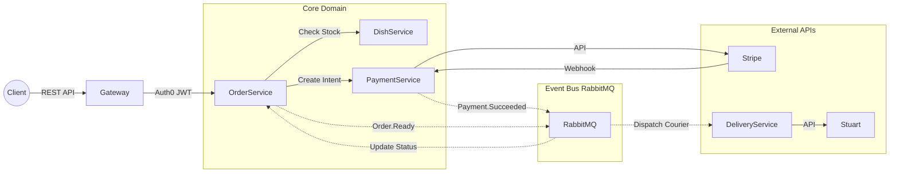

# Flavory
### Platforma łącząca seniorów-kucharzy z klientami, oferująca autentyczne domowe posiłki z dostawą.
W świecie fast-foodów i masowej produkcji, Flavory przywraca to, co najważniejsze: smak domowego ciepła. Platforma to cyfrowy most łączący dwa światy. Z jednej strony mamy seniorów - mistrzów tradycyjnej kuchni, którzy często zmagają się z samotnością lub niską emeryturą. Z drugiej strony - współczesnych klientów, którzy tęsknią za prawdziwym rosołem, pierogami czy szarlotką, ale nie mają czasu na gotowanie.

Flavory to nie tylko jedzenie. To sposób na aktywizację zawodową seniorów, budowanie więzi międzypokoleniowych i dostarczanie posiłków, które mają duszę.

# Serwisy
## Infrastruktura
- API Gateway (8080) - Spring Cloud Gateway, routing, security
- Eureka Server (8761) - Service registry & discovery
- RabbitMQ (5672/15672) - Message broker, event bus

## Logika Biznesowa
- User Service (8081) - Rejestracja, Auth0 OAuth 2.0, JWT, profile użytkowników
- Dish Service (8082) - Zarządzanie menu, magazyn, dostępność dań
- Order Service (8083) - Cykl życia zamówienia, state machine
- Payment Service (8085) - Integracja Stripe, obsługa płatności
- Delivery Service (8084) - Integracja Stuart API, zamówienia kurierów

## Bazy danych (PostgreSQL 15)
- user-db (5432) - Dane użytkowników
- dish-db (5433) - Menu i dania
- order-db (5434) - Zamówienia
- payment-db (5436) - Transakcje płatności
- delivery-db (5435) - Dane dostaw

## 🏗️ Architektura

System wykorzystuje RabbitMQ do asynchronicznej komunikacji między usługami w celu obsługi krytycznych przepływów, takich jak rezerwacja dań i wysyłka dostaw.

### Event Flow Diagram


## 🛠️ Instalacja i Konfiguracja

### 1. Wymagania wstępne
* **Docker** oraz **Docker Compose** (zainstalowane i uruchomione).
* **Java 21** (wymagana tylko jeśli chcesz uruchamiać serwisy lokalnie bez Dockera).
* Aktywne konta w serwisach: **Auth0**, **Stripe** oraz **Stuart** (Sandbox).

### 2. Konfiguracja środowiska (.env)
Utwórz plik o nazwie `.env` w głównym katalogu projektu. Ten plik jest **kluczowy**, ponieważ Docker Compose pobiera z niego hasła i klucze API.

Skopiuj poniższą zawartość i uzupełnij brakujące klucze (tam gdzie jest `your-...` lub `sk_test_...`):

```properties
# Bazy Danych (PostgreSQL)
# User Service DB
POSTGRES_DB=user_service_db
POSTGRES_USER=postgres
POSTGRES_PASSWORD=postgres
POSTGRES_HOST_PORT=5432

# Dish Service DB
DISH_POSTGRES_DB=dish_service_db
DISH_POSTGRES_USER=postgres
DISH_POSTGRES_PASSWORD=postgres
DISH_POSTGRES_HOST_PORT=5433

# Order Service DB
ORDER_POSTGRES_DB=order_service_db
ORDER_POSTGRES_USER=postgres
ORDER_POSTGRES_PASSWORD=postgres
ORDER_POSTGRES_HOST_PORT=5434

# Delivery Service DB
DELIVERY_POSTGRES_DB=delivery_service_db
DELIVERY_POSTGRES_USER=postgres
DELIVERY_POSTGRES_PASSWORD=postgres
DELIVERY_POSTGRES_HOST_PORT=5435

# Payment Service DB
PAYMENT_POSTGRES_DB=payment_service_db
PAYMENT_POSTGRES_USER=postgres
PAYMENT_POSTGRES_PASSWORD=postgres
PAYMENT_POSTGRES_HOST_PORT=5436

# Porty Serwisów (Host)
USER_SERVICE_HOST_PORT=8081
DISH_SERVICE_HOST_PORT=8082
ORDER_SERVICE_HOST_PORT=8083
DELIVERY_SERVICE_HOST_PORT=8084
PAYMENT_SERVICE_HOST_PORT=8085

# Bezpieczeństwo (Auth0)
AUTH0_ISSUER_URI=
AUTH0_AUDIENCE=

# Frontend Config (Vite)
VITE_AUTH0_DOMAIN=
VITE_AUTH0_CLIENT_ID=
VITE_AUTH0_AUDIENCE=
VITE_API_URL=

# Płatności (Stripe)
STRIPE_API_KEY=sk_test_...
STRIPE_WEBHOOK_SECRET=whsec_...

# Logistyka (Stuart API)
STUART_API_ENABLED=true
STUART_API_BASE_URL=[https://api.sandbox.stuart.com](https://api.sandbox.stuart.com)
STUART_API_CLIENT_ID=your_stuart_client_id
STUART_API_CLIENT_SECRET=your_stuart_client_secret
STUART_WEBHOOK_SECRET=your_stuart_webhook_secret

# Message Broker (RabbitMQ)
RABBITMQ_USER=guest
RABBITMQ_PASSWORD=guest
```
